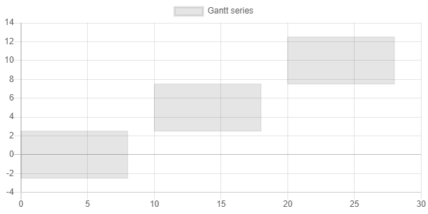

# [Gantt Chart](https://github.com/anton-shchyrov/chartjs-plugin-gantt.git) support for [Blazorise.Charts](https://blazorise.com/docs/extensions/chart/)
Integrating another chart type - what could possibly go wrong?

## Background
I'm using [Blazor](https://dotnet.microsoft.com/apps/aspnet/web-apps/blazor) in another project and needed to
show some time based data in a Gantt chart.  A quick web search showed a few commercial Blazor Gantt chart 
components, no free ones and a handful of open source, Javascript ones.  The most promising one was
[Gantt plugin](https://github.com/anton-shchyrov/chartjs-plugin-gantt.git), which is a plugin to draw gantt series 
in [Chart.js](https://www.chartjs.org/) library.

As I'm already using [Blazorise](https://github.com/Megabit/Blazorise), which already has a
[charts extension](https://github.com/Megabit/Blazorise/tree/master/Source/Extensions/Blazorise.Charts), how difficult
would it be to integrate another chart?

## Gant plugin overview

  
Gratuitous screenshots

### Sample chart

### Basic

### Different styles

### Different sizes

### Time scale

### Other

Gantt dataset supports two types of axes:
+ `linear-gantt` &mdash; the scale is inherited from the `linear` scale
+ `time-gantt` &mdash; the scale is inherited from the `time` scale

## What went right
* _Blazorise.Charts_ code generally well written and easy to follow
* _chartjs-plugin-gantt_ code a bit obfuscated but probably due to my lack of Javascript
* integration relatively straightforward
* able to show a sample gantt chart

## What went wrong
* _Chart.js_ has a huge number of options and it was unclear which applied to _chartjs-plugin-gantt_
* could not support time based gantt charts due to JSON serialiser issues
  * **this was a complete show stopper**

## Summary
Since it was not possible to support time based gannt charts, it was pointless to continue.
I hope someone finds this code and information useful.

There are some interesting links below:
* [Blazorise.Charts and ChartJs.Blazor](https://github.com/Megabit/Blazorise/issues/1454)
* [ChartJs.Blazor](https://github.com/mariusmuntean/ChartJs.Blazor)
* [Difficult times](https://github.com/mariusmuntean/ChartJs.Blazor/issues/160)

_ChartJs.Blazor_ showed the most promise:
* [fork of ChartJs.Blazor with gannt chart support](https://github.com/TrevorDArcyEvans/ChartJs.Blazor)
